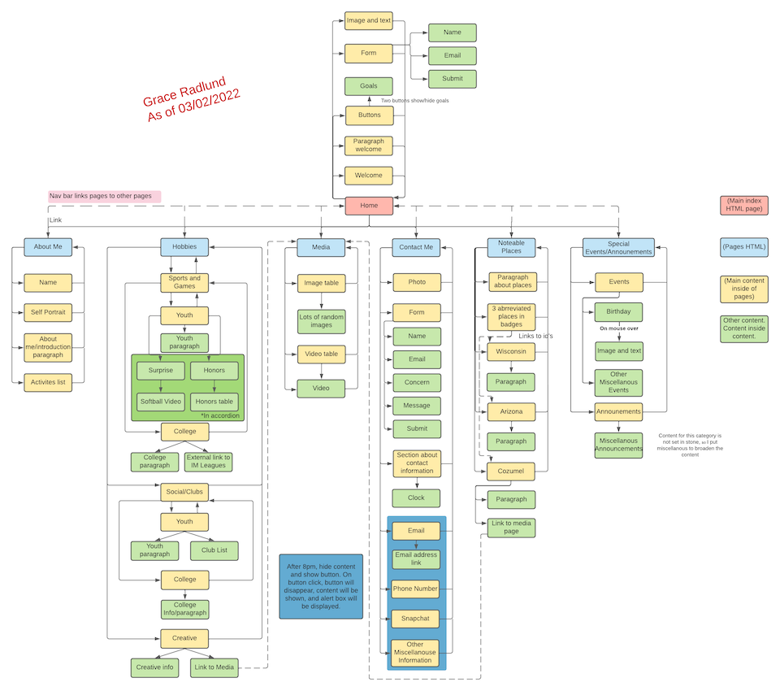
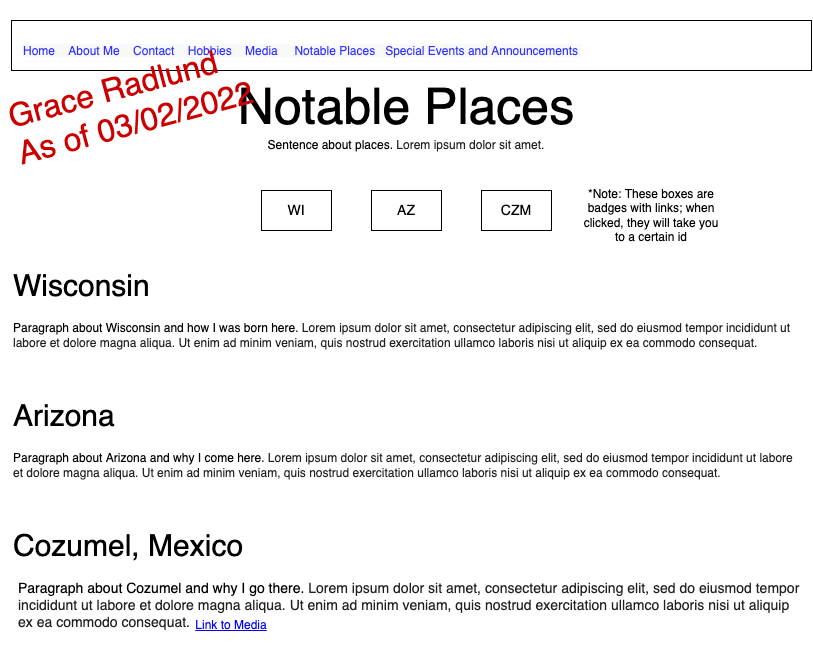

# Personal Website Project

This website was a project for Introduction to Web Development. The site was built in Visual Studio Code utilizing HTML, CSS, and JavaScript languages, as well as Bootstrap and jQuery frameworks. Wireframes and a sitemap can be found at the bottom of the Markdown as well as in their respective folders in this repo. Due to Grand Canyon University policy, code snippets are only allowed and will be the only code provided. 

#### Languages
HTML, CSS, and JavaScript

#### Frameworks
Bootstrap and jQuery

#### IDE
Visual Studio Code

#### Other Tools
Draw.io

## Functionality

The website consists of seven pages:

1. Home
2. About me
3. Contact
4. Hobbies
5. Media
6. Notable Places
7. Special Events and Announcements

## Major Concepts

#### New Langauges/Frameworks

- HTML            
- CSS            
- JavaScript     
- jQuery 
- Bootstrap 

NOTE: Code snippets will be provided for all five of these languages/frameworks.

#### Skills

- Familiarization with Visual Studio Code
- Formulating/innovating design ideas
- Creation of wireframes and a sitemap using Draw.io
- Implementation of wireframes and sitemap within web pages
- Development of web pages in HTML
- Styling of pages using CSS
- Adding interaction through JavaScript and jQuery
- Utilizing Bootstrap for fast and responsive design

         
## Code Snippets

### HTML

HTML was used for the overall structure of my website.

An unordered list was used to make a bulleted list of the activities I enjoy. (Ordered lists were also included in some pages, which made the list numbered instead of bulleted)

     <!--Unordered list added for activities I enjoy-->
     <ul align="left">
         <li>Hanging out with friends</li>
         <li>Watching sunsets</li>
         <li>Spending time with family</li>
         <li>Sports</li>
      </ul>
      
                
A table was coded on my media page to display some images I took. The first row was the header (code below), while the other four rows contained pictures that I have taken.

     <!--Header of table; colspan so that photos can be 4 columns-->
     <thead>
         <tr>
            <th colspan="4">Photos</th>
         </tr>
     </thead>
     
NOTE: this is not the complete code for the table. Only a fraction, the header, was included in the code snippet.

 
          
      
      
### CSS

CSS was used for the styling of my website. A separate CSS style sheet was created and linked to all HTML pages - all pages will now follow these formatting styles.

CSS styled the `body` of my pages to light pink from the default white. All pages will now have a light pink background.

     body {
         background-color: lightpink;
     }
    

CSS styled my `h2` header tags from the default font family and size. All `h2` tags will follow this formating.

     h2 {
         font-family: 'Times New Roman', Times, serif;
         font-size: 35px
     }

 

### JavaScript

JavaScript added functionality to my pages.

This function will make the mexico id visible. On the Special Events and Announcements page, there is a JavaScript `onmouseover` event that calls this function.

     function show() {
         //Make mexico id visible (onmouseover)
         //Resource used: https://www.w3schools.com/jsref/prop_style_visibility.asp
         document.getElementById("mexico").style.visibility = "visible";
     }
     
          
 

     
### jQuery

jQuery simplifies JavaScript code.

This jQuery code uses document ready to make sure that the page has loaded before the function is executed. The function will load the fragment/_navbar.html into the nav id. For reference, this fragment is the navigation bar code. So, the function will load the navigation bar into the nav id that is located on every page.

     $(document).ready(function(){
         $('#nav').load("fragments/_navbar.html");
     });
     

 

### Bootstrap

Bootstrap made design and customization fast and responsive.

Bootstrap's button class of `btn btn-light` styled my submit button to a whiteish-gray with rounded corners.

     <!--Submit button-->
     

          

            <button type="submit" class="btn btn-light">Send</button>
          

     
 
     
NOTE: this is a code snippet from a form and is not the complete code. 

## Sitemap

## Wiremaps

|  |  |  |  |
|------------------------------------------------------------------------------------------------------------------------------------------|------------------------------------------------------------------------------------------------------------------------|---------------------------------------------------------------------------------------------------------------------------|---------------------------------------------------------------------------------------------------------------------------|
  |  |  | | |
         

<a href="https://github.com/gradlund/personalWebsite/blob/main/README.md#personal-website-project">Back to top</a>
